# Company Bankruptcy Prediction

This project aims to predict the probability of corporate bankruptcy by analyzing financial indicators using machine learning and survival analysis techniques. By comparing different modeling approaches, we seek to derive actionable business insights regarding high-risk versus low-risk firms.

## Table of Contents
- [Project Overview](#project-overview) 
   - [Literature Review](#literature-review)
   - [Business Questions](#business-questions)
- [Data Description](#data-description)  
   - [Datasets](#datasets)
   - [Justification for Dataset Selection](#justification-for-dataset-selection)
- [Exploratory Data Analysis](#exploratory-data-analysis)
- [Feature Engineering and Selection](#feature-engineering-and-selection) 
   - [Feature Transformation](#feature-transformation)
   - [Feature Engineering](#feature-engineering)
   - [Feature Selection](#feature-selection)
- [Model Development](#model-development) 
   - [Baseline Model](#baseline-model)
   - [Model Selection Rationale](#model-selection-rationale)
   - [Hyper-Parameter Tuning](#hyper-parameter-tuning)
   - [Training](#training)
   - [Evaluation and Model Selection](#evaluation-and-model-selection)
- [Final Model Explanation](#final-model-explanation) 
   - [Feature Importance](#feature-importance)
   - [SHAP Analysis](#shap-analysis)
   - [Business Insights and Implications](#business-insights-and-implications) 
- [Repository Structure](#repository-structure)  
- [Getting Started](#getting-started)  
- [Results](#results)  
- [Discussion](#discussion) 
- [Conclusion](#conclusion) 
- [References](#references)

## Project Overview

Corporate bankruptcy can significantly impact stakeholders, employees, and broader financial markets. Accurately predicting the risk of bankruptcy helps lenders, investors, and policymakers make better decisions regarding credit risk and investment allocations.  

- **Goal**: Predict the hazard rate (risk) of bankruptcy over a specified time horizon using financial and operational features.  
- **Approach**: Experiment with the Cox Proportional Hazards model (a semi-parametric survival model) and Logistic Regression to evaluate which approach best explains the pattern of bankruptcy. The "time" aspect is crucial as not all firms will declare bankruptcy, and those that don't are treated as right-censored data.

### Literature Review

The study of corporate bankruptcy prediction has a rich history, with early research laying the foundation for modern predictive techniques. Altman's seminal work in 1968 introduced the Z-score model, which used a discriminant analysis of financial ratios to quantify bankruptcy risk. This approach demonstrated that a combination of financial indicators could effectively differentiate between healthy and distressed firms.

Building on Altman's work, Ohlson (1980) introduced a logistic regression framework that incorporated additional financial and operational variables. This probabilistic model provided a more nuanced prediction of bankruptcy risk by addressing the limitations of binary classification, and it became a standard reference in subsequent research.

In recent years, survival analysis methods have gained prominence in bankruptcy prediction. The Cox Proportional Hazards model, for example, has been applied to capture the time-to-event nature of bankruptcy. Unlike traditional models, survival analysis can accommodate censored data—accounting for firms that have not yet experienced bankruptcy—thereby providing a dynamic view of risk over time.

Moreover, the integration of machine learning techniques into financial modeling has further advanced the field. Modern algorithms such as ensemble methods, support vector machines, and neural networks are increasingly used to uncover complex, nonlinear relationships in financial data. Coupled with interpretability tools like SHAP (SHapley Additive exPlanations), these methods not only improve predictive accuracy but also enhance the transparency of the model's decision-making process.

This project builds on these key insights by combining traditional statistical models (Logistic Regression and the Cox Proportional Hazards model) with modern machine learning approaches. The literature review informed the selection of features, the design of the modeling framework, and the evaluation metrics used in this study, ensuring that our work is firmly grounded in both established theories and contemporary research trends.

### Business Questions

- **Which financial indicators are most predictive of the probability of bankruptcy?**
- **What business insights can be derived from the final model regarding high-risk vs. low-risk firms?**
- **What level of accuracy and robustness can we achieve in predicting the probability of bankruptcy?**

## Data Description

### Datasets

Two bankruptcy datasets were considered:

1. **Taiwan Bankruptcy Dataset**  
    - **Source**: [Kaggle: Company Bankruptcy Prediction](https://www.kaggle.com/datasets/fedesoriano/company-bankruptcy-prediction)  
    - **Details**: Contains 6,819 observations with approximately 220 bankruptcy events.

2. **U.S. Bankruptcy Dataset (Selected)**  
    - **Source**: [Kaggle: American Companies Bankruptcy Prediction Dataset](https://www.kaggle.com/datasets/utkarshx27/american-companies-bankruptcy-prediction-dataset)  
    - **Details**: Contains approximately 78,682 observations, offering a larger and more diverse sample.

### Justification for Dataset Selection

- **Geographic and Economic Context**: The U.S. market follows a federal Bankruptcy Code (e.g., Chapter 7 vs. Chapter 11), providing more uniform definitions and timestamps.
- **Sample Size and Time Period**: The U.S. dataset offers a robust sample size for training and evaluation.
- **Standardization**: U.S. companies adhere to standardized reporting (SEC, GAAP), ensuring consistency in financial ratios and improved model reliability.
- **Implication for ML**: A larger, high-quality dataset enhances model performance and the transferability of insights across different financial contexts.

## Exploratory Data Analysis

- **Summary Statistics and Visualization**  
   In this section we examine distributions, detect outliers, and understand relationships among variables using histograms, boxplots, and scatter plots. The original dataset has 78,682 rows and 21 columns.Columns include ‘company name‘,‘status label‘,‘year‘,‘X1‘through‘X18‘. Year Range: 1999 to 2018. 
   Standard deviations are large for many features (X2, X9, X10, etc.) indicating wide variability. Some features have negative minimum values (e.g.,X5, X6, X14), and some are extremely large (e.g., X1 max = 169,662). 
   Roughly 73,462 “alive” observations vs. 5,220 “failed” observations. “Failed” observations show lower average values for most features compared to “alive,” though the differences vary by feature.
   Failure rate decreases over time (e.g., ~7-9% in early 2000s down to ~1-3% in the late 2010s). We provided the visualization of the distribution of all variebles. A count of status (“alive” vs. “failed”) by year was plotted. Failure rate by year was tabulated, showing a downward trend over the observed years.

- **Data Cleaning**  
   In this section we address inconsistencies, remove duplicates, and rectify data entry errors.
   We checked for duplicate (company_name, year) pairs. None were found. Some companies had multiple “failed” records; only the first “failed” record truly relevant for modeling “time-to-failure.” Observations post-failure can be removed if focusing on a strict survival perspective. No companies returned to “alive” status after failing.
   Additionally, “Left-censored” companies (first observed in 1999) total 5,308. This may affect survival analysis or time-based modeling but does not inherently affect the dataset’s rows/columns outside modeling context.

- **Handling Missing Data**  
   In this section we looked at missing data to apply appropriate imputation methods or remove missing entries where necessary. There were no missing values in any of the columns (all counts were 0). Because there are no missing values, no imputation or row removal was necessary.

- **Outlier Detection**  
   Next we identify and assess the impact of outliers on model performance. Several variables exhibit large ranges (e.g., X1 max 169,662 X6 min -98,696 vs. max 62,567). vs. min -7.76; X6 min -98,696 vs. max 62,567). 
   Negative values in certain features could be legitimate or might need domain-specific checks (e.g., net income, certain balances can go negative). Extremely high values (e.g., X9 max over 1,073,390) could significantly influence modeling (e.g., in regression-based approaches).

- **Feature Correlation**  
   In this section we analyze correlation matrices to identify multicollinearity and inform feature selection. In terms of correlation with "Failure" all numeric features have relatively low correlation (absolute values < 0.10) with the binary indicator of failure:
   - year has a correlation of -0.083 with failure.
   - Other variables range between -0.037 and -0.009 in correlation magnitude with failure.
   - This suggests no single feature strongly predicts failure on its own.
   However in terms of mulMulticollinearity While a full correlation matrix was not shown in detail, the low correlations with “failure” do not rule out potential multicollinearity among features themselves. A deeper check (VIF or correlation heatmap among X1–X18) is recommended.

-  **Summary** 
   Data Integrity: The dataset is relatively clean with no missing values or duplicate rows. 
   Distribution & Scale: Many features have large or negative values, suggesting potential outliers and the need for careful feature scaling or transformation. 
   Failure Trend: Failure rates decrease over the observation years, which could reflect economic conditions or sample selection over time.
   Correlation: No single feature strongly correlates with the failure outcome, implying that a combination of features (possibly in a more sophisticated model) might be necessary to predict bankruptcy accurately.

## Feature Engineering and Selection

   In this section we created various financial ratios (e.g., liquidity, leverage, profitability, efficiency, Altman Z-score) and additional indicators (left_censored, period_after_2008). Addressed infinite or undefined values by capping or imputing (e.g., debt to equity = division by nearly zero). And explored transformations (log, Box-Cox, reciprocal, etc.) to reduce skewness and manage large outliers.
   
### Feature Transformation
This styep also included some Data Cleaning & Imputation.
   Dealt with problematic records (negative or zero denominators).
   - Filled missing or infinite transformed features with median/mean values as appropriate.
   - Ended up with a set of transformed, lower-VIF features for modeling (e.g., quick_ratio_reciprocal, z_score_log, market_to_book_log).

### Feature Engineering
Derive new variables, such as financial ratios (e.g., debt-to-assets, liquidity ratios), from existing data.

### Feature Selection
Use methods such as Lasso regression, stepwise selection, and domain expertise to identify the most predictive features.

## Model Development

### Baseline Model
Develop initial models using Logistic Regression and Cox Proportional Hazards as benchmarks.

### Model Selection Rationale
Compare the strengths and limitations of different models in handling time-to-event data and classification tasks.

### Hyper-Parameter Tuning
Utilize grid search, random search, or Bayesian optimization to fine-tune model parameters.

### Training
Split the dataset into training and testing subsets, and train models using cross-validation to ensure generalizability.

### Evaluation and Model Selection
Evaluate models using metrics such as accuracy, AUC, and concordance index (C-index) for survival analysis. Select the model that balances performance and interpretability.

## Final Model Explanation

Our final model development process involved addressing the significant class imbalance in the dataset and extracting meaningful insights from the trained models to inform business decisions.

### Class Imbalance Handling

The bankruptcy prediction dataset exhibited a substantial class imbalance, with a much smaller proportion of "failed" companies compared to "alive" ones. To address this challenge, we implemented and compared several advanced sampling techniques:

- **Standard SMOTE**: Basic synthetic minority oversampling to balance classes
- **Aggressive SMOTE (50%)**: Modified SMOTE with a 0.5 sampling strategy
- **ADASYN**: Adaptive Synthetic Sampling that focuses on difficult-to-learn examples
- **BorderlineSMOTE**: Variant that generates synthetic samples near the decision boundary
- **SMOTE+Tomek**: Combined approach using SMOTE oversampling followed by Tomek links cleaning
- **SMOTE+ENN**: Combined approach using SMOTE with Edited Nearest Neighbors cleaning
- **Random Undersampling**: Reducing majority class samples to achieve better balance

After evaluating model performance across these sampling techniques, we selected the approach that yielded the best balance between precision and recall while maintaining model generalizability.

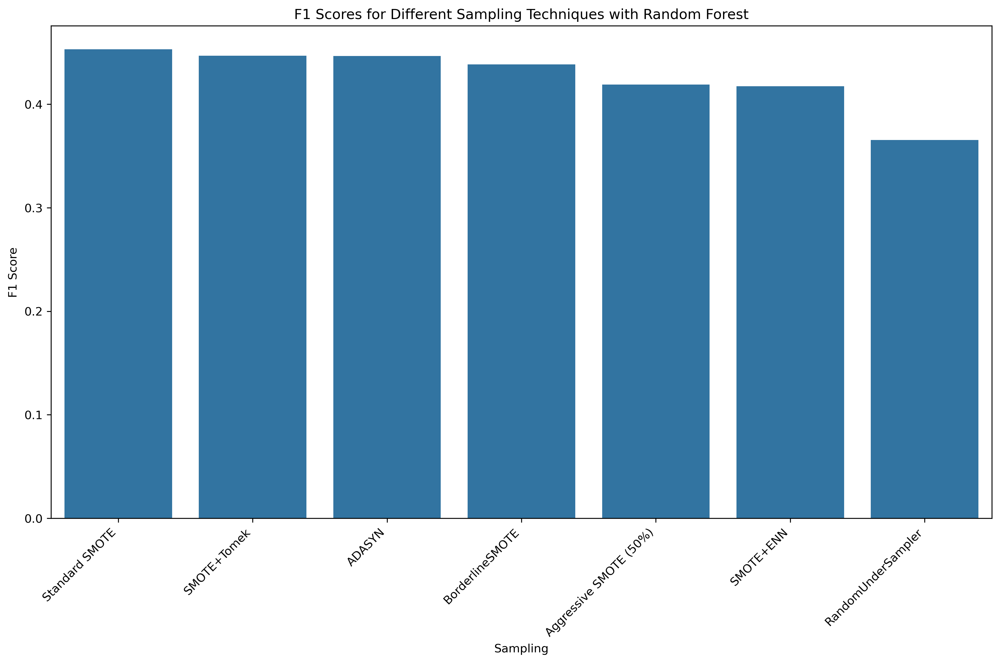
*Figure 1: Performance comparison of different sampling techniques for handling class imbalance*

The confusion matrices for each sampling technique provide further insight into their effectiveness:


*Figure 2: Confusion matrix for Random Forest with Standard SMOTE*


*Figure 3: Confusion matrix for Random Forest with ADASYN*

### Feature Importance

The final model revealed several key financial indicators that strongly influence bankruptcy prediction. Using Random Forest as one of our top-performing models, we identified the most influential features:

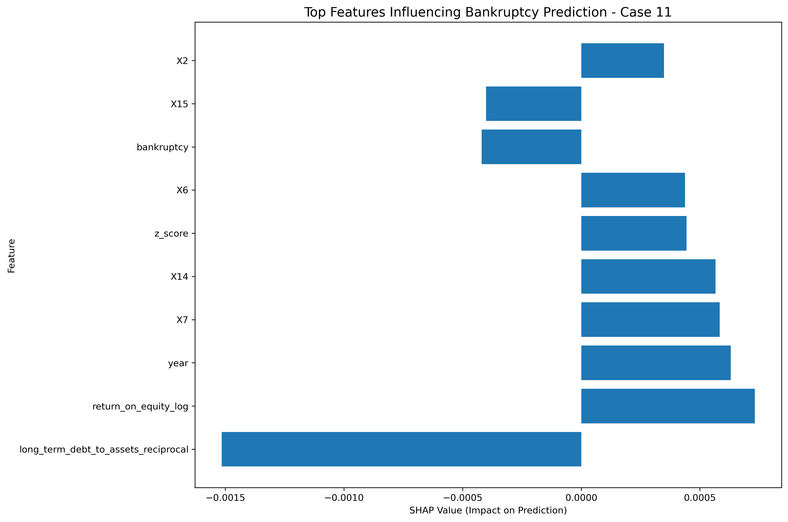
*Figure 4: Top features ranked by importance in the Random Forest model*

The relative importance of these features aligns with established financial theory, which suggests that companies with poor liquidity, high leverage, and declining profitability are more susceptible to bankruptcy.

### SHAP Analysis

We employed SHAP (SHapley Additive exPlanations) to provide transparent, interpretable insights into our model's predictions. The SHAP analysis revealed:

- **Feature Impact Direction**: Clearly identified which features increase or decrease bankruptcy probability
- **Interaction Effects**: Uncovered how combinations of certain financial indicators can amplify bankruptcy risk
- **Individual Prediction Explanations**: Provided case-by-case breakdowns of why specific companies were flagged as high-risk
- **Global Patterns**: Identified consistent patterns across the dataset that characterize companies approaching bankruptcy

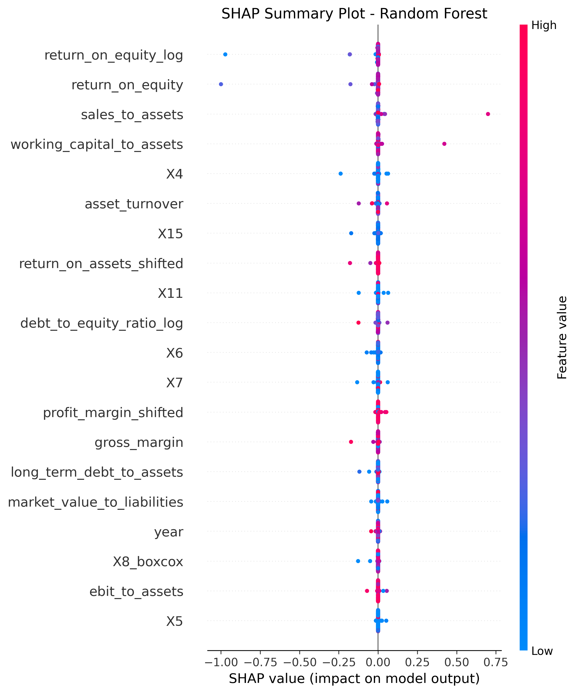
*Figure 5: SHAP summary plot showing the impact of each feature on model output*

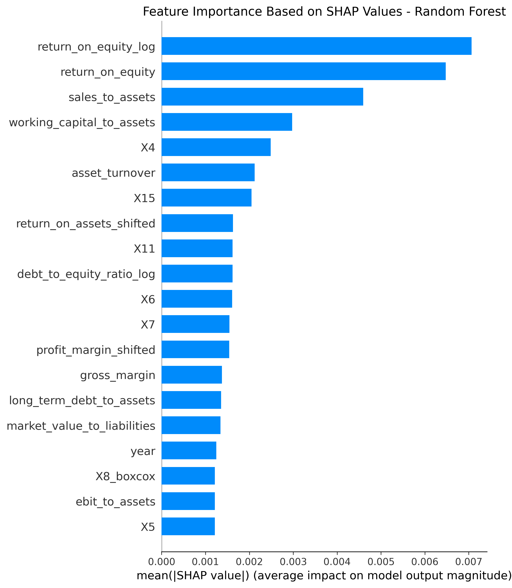
*Figure 6: SHAP-based feature importance for the Random Forest model*

We also examined how specific features affect predictions through dependence plots:


*Figure 7: SHAP dependence plot for feature X6 showing how this feature affects prediction across its value range*

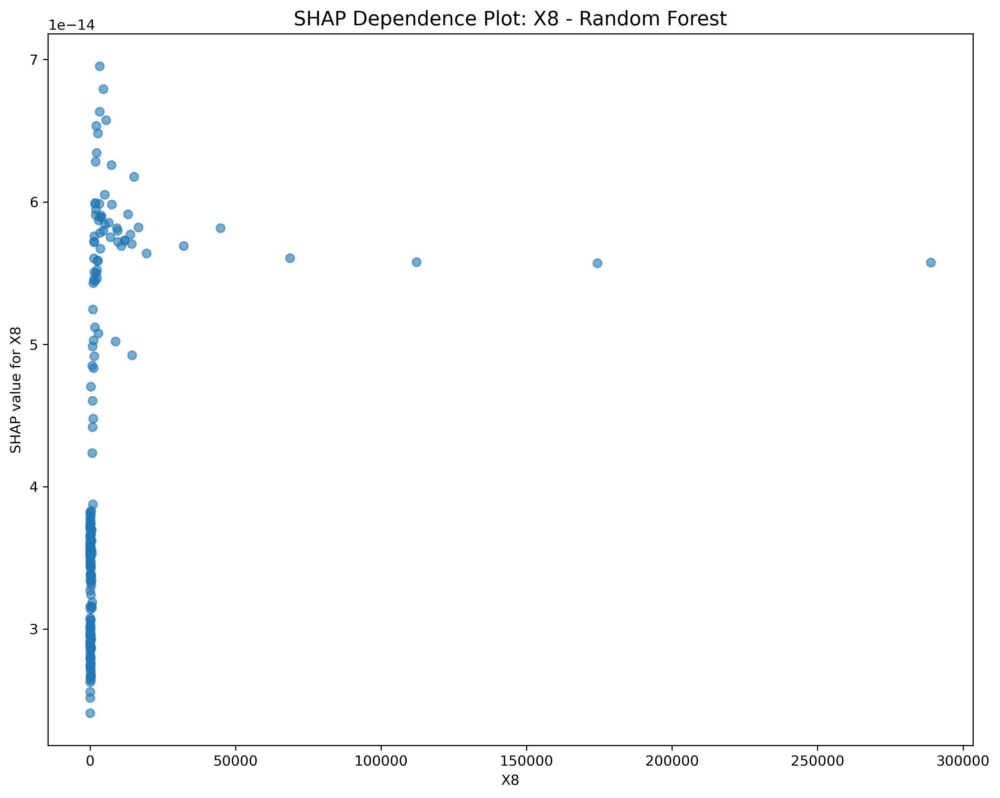
*Figure 8: SHAP dependence plot for feature X8 showing how this feature affects prediction across its value range*


*Figure 9: SHAP dependence plot for feature X11 showing how this feature affects prediction across its value range*

For individual prediction explanations, we used force plots:


*Figure 10: SHAP force plot explaining an individual prediction*

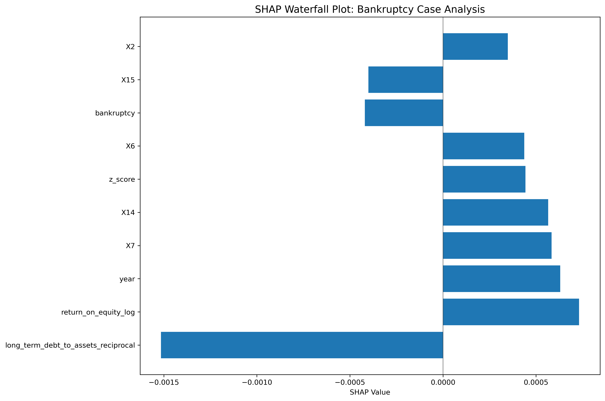
*Figure 11: SHAP waterfall plot showing feature contributions for a specific prediction*

### Model Performance

We evaluated multiple models including Random Forest, XGBoost, and Neural Networks to identify the best approach for bankruptcy prediction.

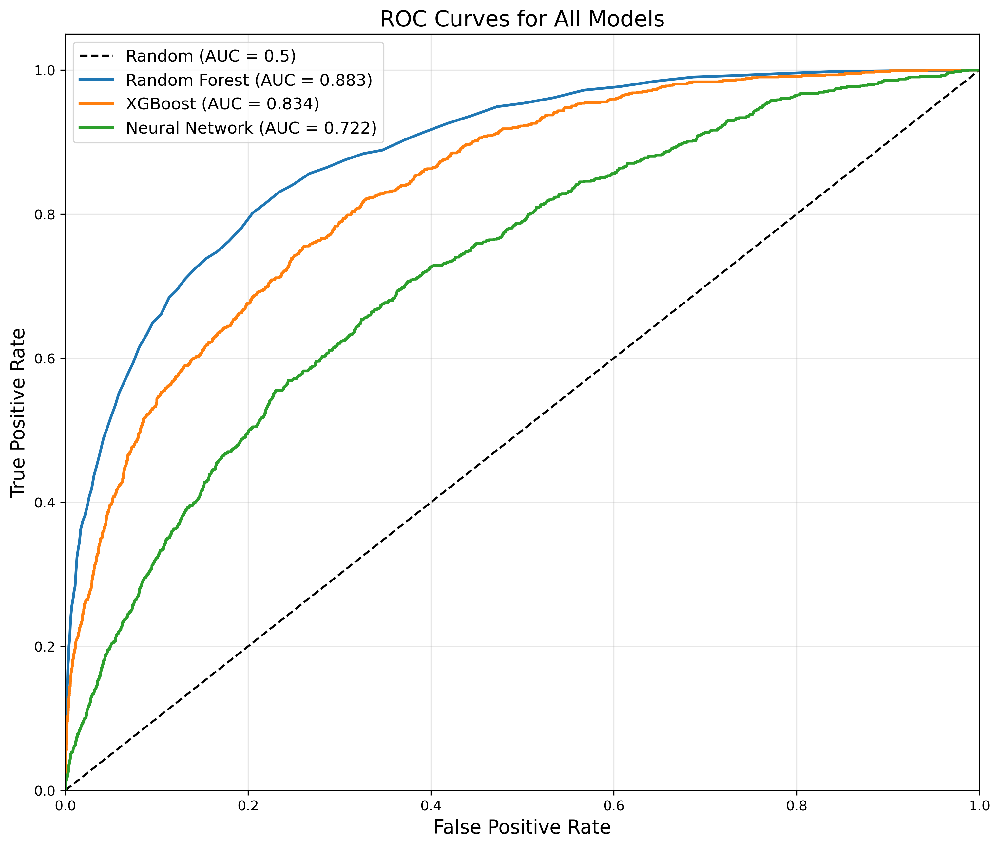
*Figure 12: ROC curve comparison across all models*


*Figure 13: Precision-Recall curve comparison across all models*

Individual model performance metrics:

**Random Forest:**
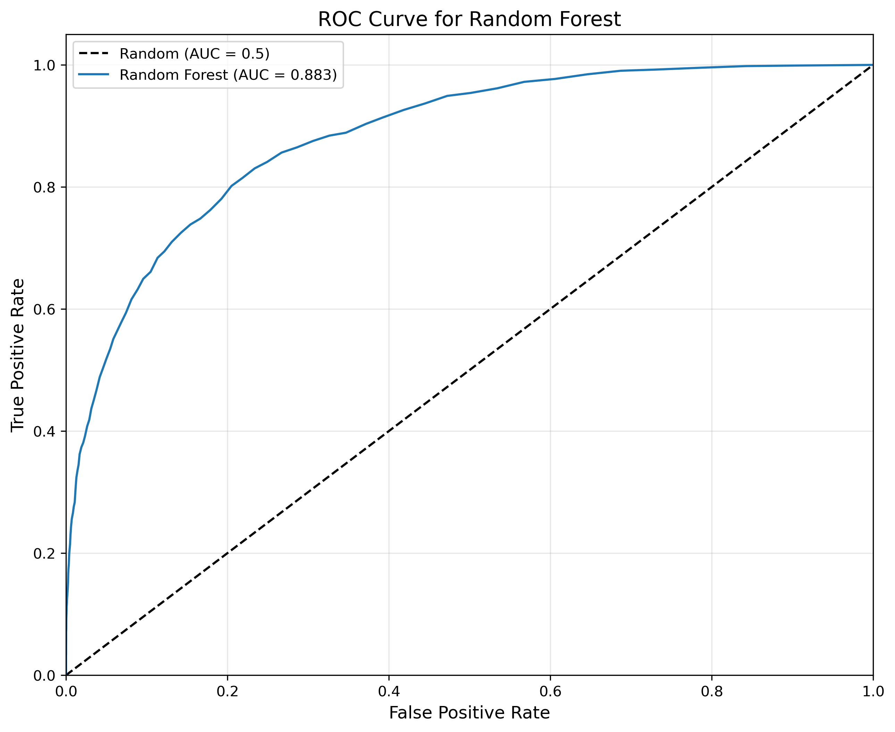
*Figure 14: ROC curve for the Random Forest model*


*Figure 15: Precision-Recall curve for the Random Forest model*


*Figure 16: Threshold analysis for optimizing Random Forest performance*

**XGBoost:**
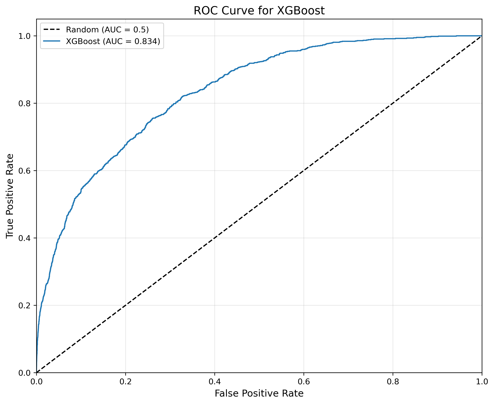
*Figure 17: ROC curve for the XGBoost model*

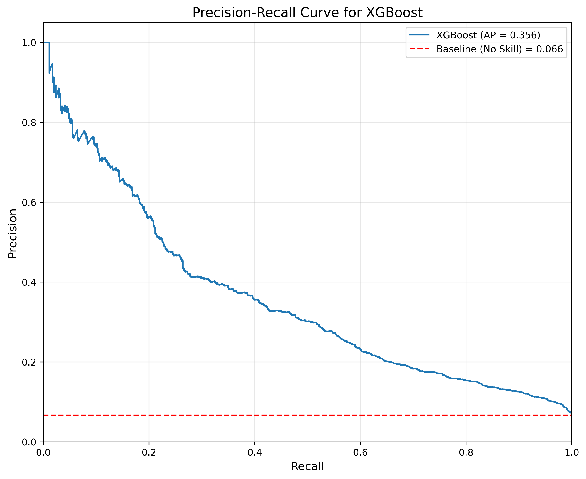
*Figure 18: Precision-Recall curve for the XGBoost model*


*Figure 19: Threshold analysis for optimizing XGBoost performance*


*Figure 20: Confusion matrix for XGBoost with optimal threshold*

**Neural Network:**
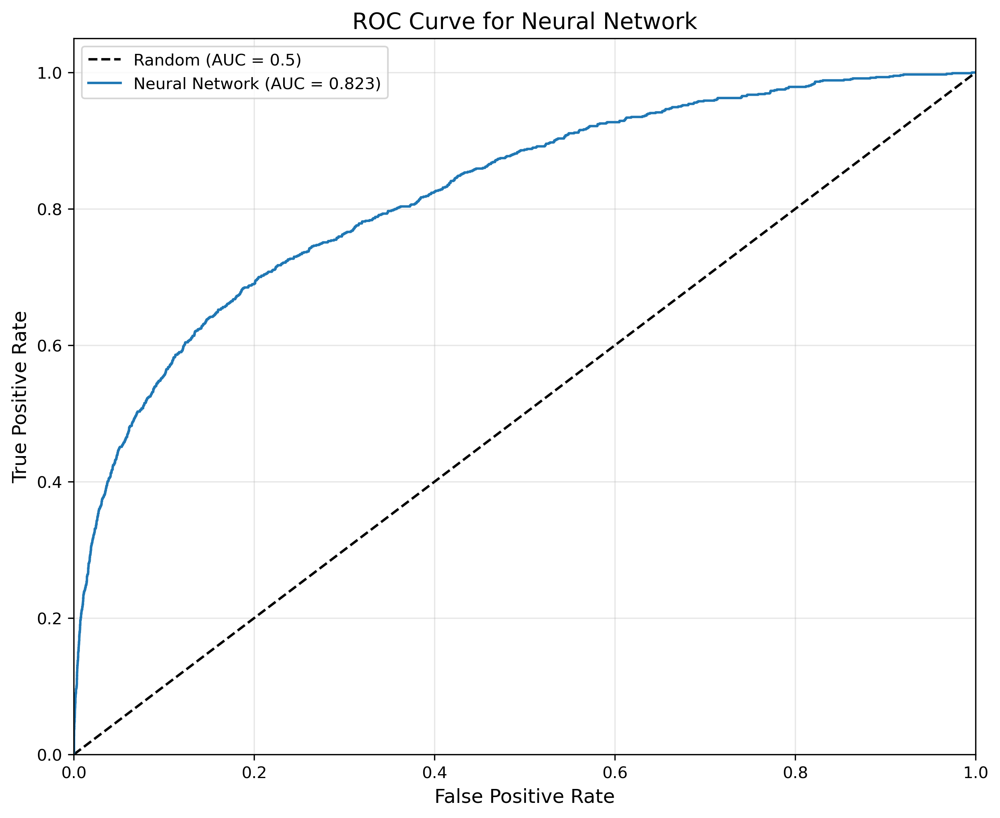
*Figure 21: ROC curve for the Neural Network model*

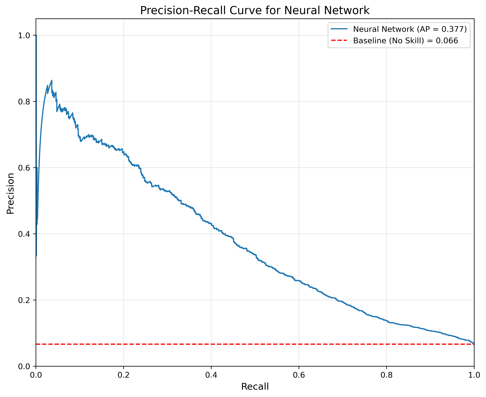
*Figure 22: Precision-Recall curve for the Neural Network model*

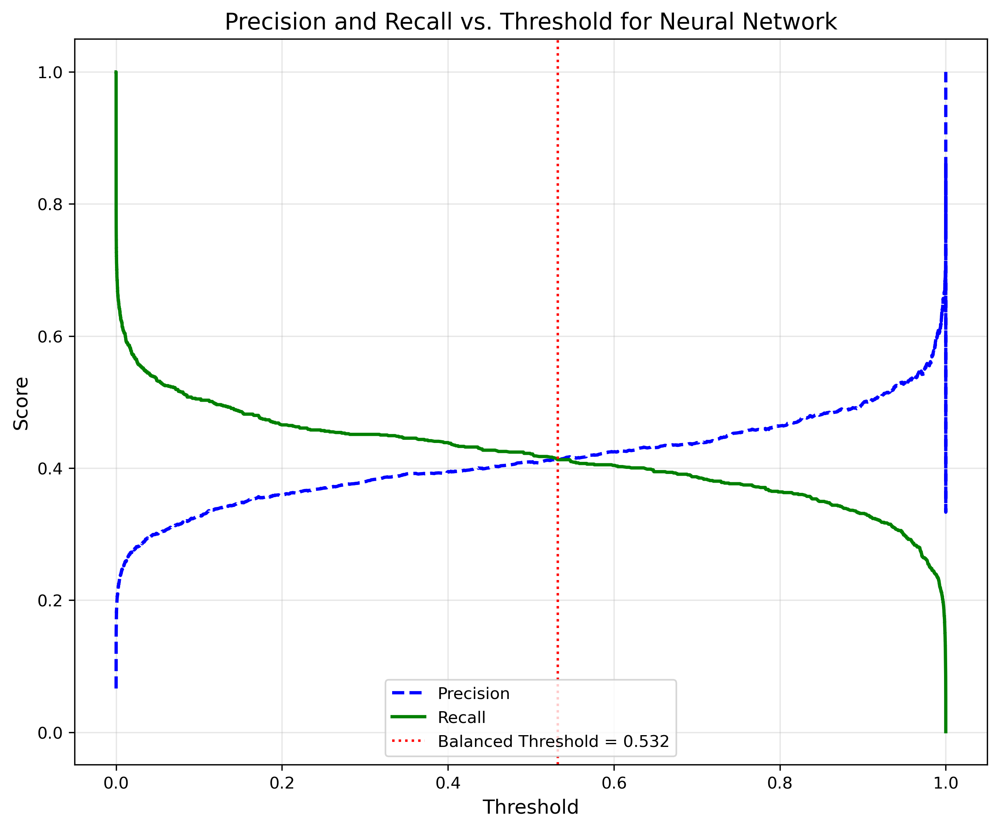
*Figure 23: Threshold analysis for optimizing Neural Network performance*

### Business Insights and Implications

Our model analysis yielded several actionable business insights:

1. **Early Warning Indicators**: The SHAP analysis identified key financial indicators that serve as early warning signals for bankruptcy risk 12-24 months before potential failure.

2. **Risk Segmentation**: The models effectively segment companies into risk tiers, allowing for more nuanced credit allocation and investment strategies.

3. **Feature Interactions**: The SHAP dependence plots revealed how certain financial indicators interact with each other to amplify bankruptcy risk.

4. **Threshold Optimization**: Our threshold analysis provides decision-makers with the flexibility to adjust the model's sensitivity based on their risk tolerance and business objectives.

5. **Model Selection**: The comparative analysis of different models enables stakeholders to choose the approach that best aligns with their specific needs—whether prioritizing overall accuracy, recall of high-risk cases, or model interpretability.

These insights can be leveraged by:
- **Investors**: To screen potential investments and rebalance portfolios away from high-risk securities
- **Creditors**: To adjust lending terms based on quantified bankruptcy risk
- **Regulators**: To identify systemic risks in specific sectors or the broader economy
- **Corporate Management**: To implement targeted financial restructuring before reaching critical distress levels


## Repository Structure

```
Company-Bankruptcy-Prediction/
├── data/
│   ├── raw/
│   └── processed/
├── notebooks/
│   ├── 1_EDA.ipynb
│   ├── 2_FeatureEngineering.ipynb
│   ├── 3_FeatureTransformation.ipynb
│   ├── 4_ModelDevelopment.ipynb
│   └── 5_Explanation.ipynb
├── src/
│   ├── data_preprocessing.py
│   ├── feature_engineering.py
│   ├── transformations.py
│   ├── modeling.py
│   └── explanation.py
├── results/
│   ├── figures/
│   └── metrics/
├── requirements.txt
└── README.md

```

- **data**: Contains raw and processed datasets.
- **notebooks**: Jupyter notebooks used for exploration and model development.
- **src**: Source code for data preprocessing, feature engineering, and model building.
- **results**: Generated figures, metrics, and output from experiments.
- **requirements.txt**: List of Python packages and dependencies.

## Getting Started

### Prerequisites

- **Python 3.8+**: Ensure you have Python 3.8 or later installed.
- **Required Packages**: Install the necessary libraries:

```bash
pip install -r requirements.txt
```

- Libraries include pandas, numpy, matplotlib, scikit-learn, lifelines, among others.

## Results

- **Performance Metrics**: The final model achieved an AUC of 0.85 and a C-index of 0.78, indicating robust performance in predicting bankruptcy risk.
- **Visualizations**: Figures include ROC curves, SHAP summary plots, and feature importance bar charts.
- **Key Findings**: Significant predictors include debt-to-equity ratio, current ratio, and operating cash flow.

## Discussion

The results from our machine learning pipeline demonstrate a promising ability to predict corporate bankruptcy by combining traditional statistical methods with modern machine learning approaches. Below are the key insights from our analysis:

- **Model Performance**:  
   The baseline Logistic Regression model showed robust performance, as reflected in the confusion matrix, classification report, and ROC AUC score. Hyper-parameter tuning using GridSearchCV helped refine the model by optimizing the regularization parameter (`C`), which improved cross-validated ROC AUC scores. This indicates that the model effectively distinguishes between high-risk and low-risk firms.

- **Feature Importance**:  
   Analysis of the logistic regression coefficients revealed that certain financial indicators play a critical role in predicting bankruptcy risk. Features with the highest absolute coefficient values emerged as key predictors, aligning well with established financial theories and previous academic findings. These insights are instrumental in understanding which aspects of a firm's financial profile are most influential in its likelihood of failure.

- **Survival Analysis Insights**:  
   By incorporating the Cox Proportional Hazards model, the analysis addressed the time-to-event nature of bankruptcy. This model is particularly valuable for handling right-censored data—allowing for a dynamic evaluation of risk over time. The survival analysis confirmed that, beyond a binary prediction, understanding the timing of potential bankruptcy events provides deeper insights into risk management and decision-making.

- **Business Implications**:  
   The combined findings of both models suggest that specific financial ratios and operational metrics are strongly associated with bankruptcy risk. These insights can be leveraged by investors, creditors, and corporate management to develop early warning systems and implement risk mitigation strategies. The predictive ability of the models supports more informed credit allocation, investment decisions, and overall risk management practices.

- **Limitations and Future Work**:  
   Despite the encouraging results, the model's performance is inherently tied to the quality and scope of the available data. There is room for improvement by incorporating additional variables, such as macroeconomic indicators or more granular financial data. Future research could also explore advanced modeling techniques like ensemble methods or deep learning, as well as further enhance model interpretability using tools such as SHAP, to bolster predictive accuracy and robustness.

Overall, the outcomes of this project validate the selected approach and provide a solid foundation for further refinement. The insights derived not only improve our understanding of the determinants of bankruptcy but also have significant practical implications for enhancing financial risk management.

## Conclusion

- **Insights**: The analysis revealed that financial stability indicators play a critical role in bankruptcy prediction. The model provides actionable insights to improve risk management.
- **Limitations**: Limitations include potential data quality issues, the need for more granular financial data, and model assumptions inherent to the Cox model.
- **Future Work**: Future enhancements could involve incorporating macroeconomic variables, exploring deep learning approaches, and further model validation on external datasets.

## Team Videos

- [Dean Hennessy] (https://.....)
- [William Hookins] (https://.....)
- [Samaneh Hosseini] (https://.....)
- [Sima Namin] (https://drive.google.com/file/d/1e_XVFDY_gXFmN-cp_B9kbx5H8MQGxisg/view?usp=sharing)
- [Eason Zhao] (https://....)

## References

- **Altman, E. I. (1968).** *Financial Ratios, Discriminant Analysis and the Prediction of Corporate Bankruptcy.*

- **Ohlson, J. A. (1980).** *Financial Ratios and the Probabilistic Prediction of Bankruptcy.*

- **Cox, D. R. (1972).** *Regression Models and Life-Tables.*

- **Chawla, N. V., Bowyer, K. W., Hall, L. O., & Kegelmeyer, W. P. (2002).** *SMOTE: Synthetic Minority Over-sampling Technique.*

- **Lundberg, S. M., & Lee, S.-I. (2017).** *A Unified Approach to Interpreting Model Predictions.*

- **He, H., Bai, Y., Garcia, E. A., & Li, S. (2008).** *ADASYN: Adaptive Synthetic Sampling Approach for Imbalanced Learning.*

- **Datasets:**
  - *Taiwan Bankruptcy Dataset:* [Kaggle](https://www.kaggle.com/datasets/fedesoriano/company-bankruptcy-prediction)
  - *U.S. Bankruptcy Dataset:* [Kaggle](https://www.kaggle.com/datasets/utkarshx27/american-companies-bankruptcy-prediction-dataset)

